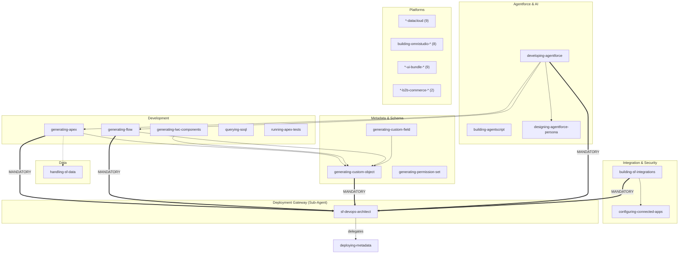

# Salesforce Skills for Agentic Coding Tools

[](https://opensource.org/licenses/MIT)
[](https://claude.ai/code)
[](#-available-skills)
[](https://www.salesforce.com/)

A reconciled, best-of-all collection of **62 reusable skills** spanning the full Salesforce platform: Apex, LWC, Flow, SOQL, metadata, DevOps, Agentforce, Data Cloud, OmniStudio, B2B Commerce, and React UI bundles. Built for Claude Code with planned support for other agentic coding tools.

> This set merges two skill libraries (the Agentforce Vibes `afv-skills` set and the scored `sf-*` skill packs) into one gerund-named, flat `skills/` layout. Each skill keeps the best of both: scoring rubrics, validation hooks, reference docs, and asset templates.

---

## What is a Skill?

> **Skills are portable knowledge packs that supercharge AI coding agents with domain expertise.**

Think of skills as "installable superpowers" for your agentic coding tool. Instead of repeatedly explaining Salesforce best practices to your AI assistant, a skill pre-loads that knowledge so the AI becomes an instant expert.

```
skills/generating-apex/
├── SKILL.md              # The brain - prompts, workflow, and scoring rubric
├── assets/               # Code templates & patterns
├── references/           # Deep-dive guides loaded on demand
├── hooks/                # Validation scripts (run on Write/Edit)
└── CREDITS.md            # Community attribution
```

> Skills are open-source and composable. Fork, customize, or create your own.

### Why Use Skills?

**1. Instant Expertise** - the AI knows Trigger Actions Framework, Flow bulkification, Data Cloud phase boundaries, and OmniStudio patterns from the first message.

**2. Automatic Validation** - many skills score output against 50-165 point rubrics and run hooks to catch anti-patterns before deployment.

**3. Built-in Templates** - production-ready assets across Apex, Flow, metadata, Agentforce, Data Cloud, OmniStudio, and UI bundles.

**4. Tool Orchestration** - "Deploy to production" becomes a single command. Skills handle `sf` CLI complexity.

**5. Context Efficiency** - skills load only when invoked, saving tokens versus pasting prompts every conversation.

| Before | After |
|--------|-------|
| Prompt engineering every conversation | `Skill(skill="generating-apex")` |
| 10+ messages to explain requirements | 1 message, the skill fills the gaps |
| Review code manually for issues | Hooks validate on every save |

---

## Supported Agentic Coding Tools

| Tool | Status | |
|------|--------|--|
| **Claude Code CLI** | Full Support |  |
| **Amp CLI** | Compatible |  |
| **Droid CLI** | Setup Required |  |
| **Codex CLI** | Experimental |  |
| **Agentforce Vibes CLI** | Planned |  |
| **Google Gemini CLI** | Planned |  |

---

## Available Skills

All skills live in a flat [`skills/`](skills/) directory, one gerund-named directory each. Scoring rubrics are noted where a skill defines one.

### Apex & Code Quality
| Skill | Description | Scoring |
|-------|-------------|---------|
| [generating-apex](skills/generating-apex/) | Apex classes, triggers, async jobs, REST resources, and evidence-based review | 150-pt |
| [generating-apex-test](skills/generating-apex-test/) | Apex test classes, TestDataFactory patterns, bulk (251+) testing, mocking | - |
| [running-apex-tests](skills/running-apex-tests/) | Test execution, coverage analysis, disciplined test-fix loops | 120-pt |
| [debugging-apex-logs](skills/debugging-apex-logs/) | Debug log analysis, governor limits, stack traces | 100-pt |
| [running-code-analyzer](skills/running-code-analyzer/) | Salesforce Code Analyzer V5 scans (PMD, ESLint, CPD, RetireJS, SFGE, Flow) | - |
| [querying-soql](skills/querying-soql/) | SOQL/SOSL authoring, optimization, selectivity, and query-plan analysis | 100-pt |

### Lightning Web Components & UI
| Skill | Description | Scoring |
|-------|-------------|---------|
| [generating-lwc-components](skills/generating-lwc-components/) | LWC with the PICKLES methodology, wire service, SLDS, and Jest tests | 165-pt |
| [uplifting-components-to-slds2](skills/uplifting-components-to-slds2/) | Migrate LWC from SLDS 1 to SLDS 2 (styling hooks, linter fixes) | - |
| [generating-flexipage](skills/generating-flexipage/) | Lightning pages (Record, App, Home FlexiPages) | - |

### Automation
| Skill | Description | Scoring |
|-------|-------------|---------|
| [generating-flow](skills/generating-flow/) | Record-triggered, screen, autolaunched, and scheduled Flows with validation | 110-pt |

### Metadata & Schema
| Skill | Description |
|-------|-------------|
| [generating-custom-object](skills/generating-custom-object/) | Custom objects - the metadata hub that orchestrates the family |
| [generating-custom-field](skills/generating-custom-field/) | Custom fields: all types, relationships, roll-ups, formulas |
| [generating-validation-rule](skills/generating-validation-rule/) | Save-time validation rules |
| [generating-permission-set](skills/generating-permission-set/) | Permission-set generation **and** access analysis/auditing |
| [generating-custom-tab](skills/generating-custom-tab/) | Custom tabs (object, web, Lightning component) |
| [generating-custom-application](skills/generating-custom-application/) | Custom applications and navigation |
| [generating-list-view](skills/generating-list-view/) | List views |
| [generating-custom-lightning-type](skills/generating-custom-lightning-type/) | Custom Lightning types |
| [generating-lightning-app](skills/generating-lightning-app/) | Full Lightning app orchestration from a description |

### Data
| Skill | Description | Scoring |
|-------|-------------|---------|
| [handling-sf-data](skills/handling-sf-data/) | Bulk import/export, test data factories, record seeding/cleanup | 130-pt |

### DevOps & Deployment
| Skill | Description |
|-------|-------------|
| [deploying-metadata](skills/deploying-metadata/) | sf CLI v2 DevOps: deploy, scratch orgs, sandboxes, CI/CD |
| [switching-org](skills/switching-org/) | Switch the active org/deployment target |

### Documentation & Diagrams
| Skill | Description | Scoring |
|-------|-------------|---------|
| [fetching-salesforce-docs](skills/fetching-salesforce-docs/) | Authoritative retrieval of official Salesforce documentation | - |
| [generating-mermaid-diagrams](skills/generating-mermaid-diagrams/) | Mermaid architecture diagrams, ERDs, OAuth flows, sequences | 80-pt |
| [generating-visual-diagrams](skills/generating-visual-diagrams/) | AI image generation (Nano Banana Pro) for mockups and visual ERDs | - |

### Integration & Security
| Skill | Description | Scoring |
|-------|-------------|---------|
| [building-sf-integrations](skills/building-sf-integrations/) | Named Credentials, External Services, REST/SOAP callouts, Platform Events, CDC | 120-pt |
| [configuring-connected-apps](skills/configuring-connected-apps/) | Connected Apps and External Client Apps, OAuth/JWT flows | 120-pt |

### Agentforce & AI
| Skill | Description | Scoring |
|-------|-------------|---------|
| [developing-agentforce](skills/developing-agentforce/) | Build agents via Agent Script and the Setup UI / Agent Builder path | 100-pt |
| [building-agentscript](skills/building-agentscript/) | Agent Script DSL for deterministic, FSM-based agents (`.agent` files) | - |
| [designing-agentforce-persona](skills/designing-agentforce-persona/) | Agent persona, voice, tone, and register design | 50-pt |
| [testing-agentforce](skills/testing-agentforce/) | Agent test suites, topic routing, dual-track evaluation | 100-pt |
| [observing-agentforce](skills/observing-agentforce/) | Session tracing and STDM telemetry analysis | - |

### Data Cloud
| Skill | Description |
|-------|-------------|
| [orchestrating-datacloud](skills/orchestrating-datacloud/) | Cross-phase pipeline orchestrator (connect to act) |
| [connecting-datacloud](skills/connecting-datacloud/) | Connect: connections, connectors, source browsing |
| [preparing-datacloud](skills/preparing-datacloud/) | Prepare: data streams, DLOs, transforms, Document AI |
| [harmonizing-datacloud](skills/harmonizing-datacloud/) | Harmonize: DMOs, mappings, identity resolution, data graphs |
| [segmenting-datacloud](skills/segmenting-datacloud/) | Segment: segments and calculated insights |
| [activating-datacloud](skills/activating-datacloud/) | Act: activations, activation targets, data actions |
| [retrieving-datacloud](skills/retrieving-datacloud/) | Retrieve: SQL, async queries, vector/search index |
| [getting-datacloud-schema](skills/getting-datacloud-schema/) | DLO/DMO schema and field introspection |
| [developing-datacloud-code-extension](skills/developing-datacloud-code-extension/) | Python Data Cloud Code Extensions (init/run/scan/deploy) |

### OmniStudio (Industries Common Core)
| Skill | Description | Scoring |
|-------|-------------|---------|
| [building-omnistudio-omniscript](skills/building-omnistudio-omniscript/) | OmniScripts - guided, multi-step experiences | 120-pt |
| [building-omnistudio-flexcard](skills/building-omnistudio-flexcard/) | FlexCards - at-a-glance UI cards | 130-pt |
| [building-omnistudio-integration-procedure](skills/building-omnistudio-integration-procedure/) | Integration Procedures - server-side orchestration | 110-pt |
| [building-omnistudio-datamapper](skills/building-omnistudio-datamapper/) | Data Mappers (formerly DataRaptors) | 100-pt |
| [building-omnistudio-callable-apex](skills/building-omnistudio-callable-apex/) | `System.Callable` Apex extensions for OmniStudio | 120-pt |
| [analyzing-omnistudio-dependencies](skills/analyzing-omnistudio-dependencies/) | Namespace detection, dependency and impact analysis | - |
| [modeling-omnistudio-epc-catalog](skills/modeling-omnistudio-epc-catalog/) | Enterprise Product Catalog modeling | - |
| [deploying-omnistudio-datapacks](skills/deploying-omnistudio-datapacks/) | DataPack deployment via Vlocity Build | - |

### B2B Commerce
| Skill | Description |
|-------|-------------|
| [creating-b2b-commerce-store](skills/creating-b2b-commerce-store/) | Create B2B Commerce stores and retrieve storefront metadata |
| [integrating-b2b-commerce-open-code-components](skills/integrating-b2b-commerce-open-code-components/) | Integrate open-source B2B Commerce components |

### CMS & Media
| Skill | Description |
|-------|-------------|
| [applying-cms-brand](skills/applying-cms-brand/) | Apply CMS brand configuration |
| [searching-media](skills/searching-media/) | Search media assets |

### Web Apps (UI Bundles)
| Skill | Description |
|-------|-------------|
| [building-ui-bundle-app](skills/building-ui-bundle-app/) | Orchestrator: build a complete React UI-bundle app end to end |
| [building-ui-bundle-frontend](skills/building-ui-bundle-frontend/) | Frontend implementation for a UI bundle |
| [generating-ui-bundle-metadata](skills/generating-ui-bundle-metadata/) | Scaffold and configure UI-bundle metadata (`ui-bundle.json`, CSP) |
| [generating-ui-bundle-features](skills/generating-ui-bundle-features/) | Add authentication and search features |
| [generating-ui-bundle-site](skills/generating-ui-bundle-site/) | Generate a UI-bundle site |
| [using-ui-bundle-salesforce-data](skills/using-ui-bundle-salesforce-data/) | Salesforce record access via the GraphQL data SDK |
| [implementing-ui-bundle-file-upload](skills/implementing-ui-bundle-file-upload/) | File upload with ContentVersion integration |
| [implementing-ui-bundle-agentforce-conversation-client](skills/implementing-ui-bundle-agentforce-conversation-client/) | Embed an Agentforce conversation client |
| [deploying-ui-bundle](skills/deploying-ui-bundle/) | Deploy a UI bundle |

## Available Sub-Agents

| Sub-Agent | Description | Status |
|-----------|-------------|--------|
| [sf-devops-architect](agents/) | Deployment gateway - orchestrates Salesforce deployments | Live |

> **Skills vs Sub-Agents:** Skills are invoked with `Skill(skill="name")`. Sub-agents are invoked with `Task(subagent_type="name", ...)` and can run autonomously in the background.

## Installation

Add the marketplace to Claude Code, then install:

```bash
/plugin marketplace add Marceswan/sf-skills
/plugin install sf-skills
```

The `sf-skills` plugin bundles all 62 skills plus `skill-builder`. Skills activate automatically when their triggers match your request, or call one explicitly with `Skill(skill="generating-apex")`.

## Architecture

Skills are organized by domain and all deployments funnel through the deployment-gateway sub-agent.



### Deployment Gateway

All deployments should go through the `sf-devops-architect` sub-agent for consistent validation and orchestration:

```
Task(subagent_type="sf-devops-architect", prompt="Deploy to [org]")
```

It delegates to the [deploying-metadata](skills/deploying-metadata/) skill and supports background/parallel deployments via `run_in_background=true`.

## Plugin Features

### Automatic Validation Hooks

Several skills include hooks that run on **Write** and **Edit** to score and lint output (advisory, non-blocking):

| Skill | File Types | Validation |
|-------|-----------|------------|
| generating-apex | `*.cls`, `*.trigger` | 150-pt scoring + Code Analyzer |
| generating-flow | `*.flow-meta.xml` | 110-pt scoring + Flow checks |
| querying-soql | `*.soql` | Selectivity, governor limits, query plan |
| handling-sf-data | `*.apex`, `*.soql` | SOQL patterns, governor limits |
| generating-lwc-components | `*.js`, `*.html`, `*.css` | SLDS, wire patterns, Jest |
| running-apex-tests | `*Test.cls` | Coverage and assertion patterns |
| building-sf-integrations | `*.namedCredential-meta.xml` | Callout/credential patterns |
| building-agentscript | `*.agent` | Agent Script syntax validation |
| generating-custom-object/field | `*.object-meta.xml`, `*.field-meta.xml` | Metadata best practices |

#### Code Analyzer V5 Integration

Hooks integrate [Salesforce Code Analyzer V5](https://developer.salesforce.com/docs/platform/salesforce-code-analyzer) for out-of-the-box linting alongside custom scoring. Shared analyzer configuration and rules live in [`shared/code_analyzer/`](shared/code_analyzer/).

| Engine | Checks | Dependency |
|--------|--------|------------|
| PMD | Apex security, bulkification, complexity, testing | Java 11+ |
| SFGE | Data-flow / path-based security | Java 11+ |
| ESLint | JavaScript / LWC | Node.js |
| Flow Scanner | Flow best practices | Python 3.10+ |
| Regex | Hardcoded patterns, trailing whitespace | None |

**Graceful degradation:** if a dependency is missing, hooks run custom validation only and report which engines were skipped.

## Prerequisites

**Required:**
- **Claude Code** (latest)
- **Salesforce CLI** v2.x (`sf`)
- **Python 3.10+** (validation hooks and helper scripts)

**Optional** (enables additional engines / skills):
- **Java 11+** - PMD, CPD, SFGE engines (`brew install openjdk@11`)
- **Node.js** - ESLint, RetireJS, and UI-bundle skills (`brew install node`)
- **Code Analyzer plugin** - `sf plugins install code-analyzer`

## Usage Examples

### Apex, SOQL & Testing
```
"Generate an Apex trigger for Account using Trigger Actions Framework"
"Optimize this SOQL query for selectivity on a 5M-row object"
"Create a test class with 90%+ coverage and bulk (251 record) tests"
"Analyze this debug log - I'm hitting a CPU time limit"
```

### Metadata & Schema
```
"Create a custom object Invoice with an auto-number name field"
"Add a roll-up summary field to Account that sums child Opportunity amounts"
"Generate a permission set for invoice managers with full CRUD"
"Who has edit access to the Contact.SSN__c field?"
```

### Flow & LWC
```
"Create a record-triggered flow for opportunity stage changes"
"Build an LWC datatable wired to an Apex controller with Jest tests"
"Uplift this component to SLDS 2"
```

### Agentforce
```
"Create an Agentforce agent for customer support triage"
"Write an Agent Script .agent file with deterministic topic routing"
"Design a persona and voice for our retail concierge agent"
"Build a test suite that validates topic routing and escalation"
"Analyze last week's agent sessions for drop-off points"
```

### Data Cloud
```
"Set up an Amazon S3 data stream and map it to a DLO"
"Configure identity resolution to unify customer profiles"
"Create a segment of high-value customers and activate it to Marketing Cloud"
```

### OmniStudio
```
"Build an OmniScript for new account onboarding"
"Create a FlexCard showing account health at a glance"
"Build an Integration Procedure that aggregates orders from two systems"
"Analyze dependencies before I change this Data Mapper"
```

### Integration & Deployment
```
"Create a Named Credential for the Stripe API with OAuth client credentials"
"Generate an External Client App for our mobile app with PKCE"
"Deploy my Apex classes to sandbox with specified tests"
```

### Web Apps (UI Bundles)
```
"Build a React UI-bundle app to manage property rentals"
"Add login and global search to my UI bundle"
"Add file upload that saves to ContentVersion"
```

## Roadmap

The reconciled set now covers the platform broadly, including domains previously listed as planned (Data Cloud, OmniStudio, testing, debugging, docs, UI bundles, B2B Commerce). Remaining candidates:

| Area | Candidate Skills | Status |
|------|------------------|--------|
| Security | sharing rules, OWD, Shield encryption | Planned |
| Migration | org-to-org, metadata comparison | Planned |
| AI | Einstein Copilot, Prompt Builder library, Prediction Builder | Planned |
| Clouds | Sales, Service, Experience cloud specializations | Planned |
| Industries | Health Cloud, Financial Services Cloud, Revenue/CPQ | Planned |

**Total: 62 skills + 1 sub-agent.**

## Contributing

1. Fork the repository
2. Create a feature branch
3. Add or edit a skill under `skills/<gerund-name>/` (one level deep, with a `SKILL.md` whose `name:` matches the directory)
4. Register it in `.claude-plugin/marketplace.json`
5. Open a Pull Request

See [CONTRIBUTING.md](CONTRIBUTING.md) for detailed guidelines.

## Issues & Support

- [GitHub Issues](https://github.com/Marceswan/sf-skills/issues)

## License & Attribution

MIT License - see [LICENSE](LICENSE).

This is a reconciled derivative that merges the Agentforce Vibes `afv-skills` skill set with the scored `sf-*` skill packs originally authored by **Jag Valaiyapathy** ([Jaganpro/sf-skills](https://github.com/Jaganpro/sf-skills)). Individual skills retain their own `LICENSE`/`CREDITS.md` and community attribution. The upstream `afv-skills` content is distributed by Salesforce under CC-BY-NC-4.0; review per-skill license headers before commercial use.
